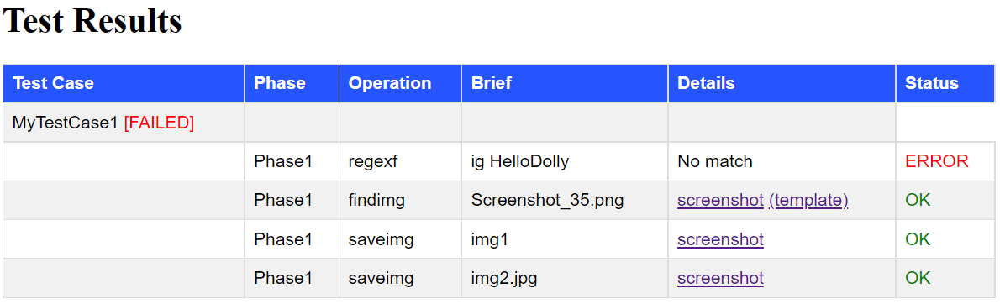

# Test Caser

A tool evaluating a success/failure of individual test steps performed as part of automatic UI testing.


This tool is able to:

* Check log files for presence of regular expressions
* Check if the screen contains an image
* Generate HTML test report with results

It does NOT perform:

* Simulating user input/actions - this is left to another control script/tool to do


### Integration with any test tool

The tool is command-line based so it can be started from whatever other testing application or script.

The control script shell call this tool every time when it needs to check the expected outcome of recently executed test step.

This tool returns error code specifying whether the the step has passed or failed base on criteria defined on the command line.


Example of a command sequence in a control script file or an arbitrary testing tool

('tc' stands for invocation of our test tool)

```powershell
# setup the test case
tc clear # clears all results saved so far
tc case "MyTestCase" # under what name to group the results of the tests to be  made

# reproduce some test case situation, for example opening some new window
notepad "myDocument.txt"
    
# try to find and image on the screen, remember result, end if failed
tc findimg myButtonPattern.png || goto :end

# execute another test step
...

# check the result
tc ...


:end
# generate test report
tc report results 

```


### Test report




# Specifiers
Many commands need arguments specifying various elements like file names, windows, screen area coordinates or regular expressions.

There are various ways available how to specify those elements. For example a file can be can be specified directly by its path in the file system, or found based by a file mask. Similarly a window can be specified via its window handle or base on its title. Screen area can be defined as absolute screen coordinates, or coordinates relative to concrete display, or withim given window etc.

An element can be specified either directly (like a file can be specified by its path in the file system) or indirectly via preset names.

The following section list the most common specifiers:

## <*fileSpec*>

Specifies a file path.

Examples of diferent ways how to specify a file:
```javascript
"path/to/file.txt" // file path
{path:'path/to/file.txt'}
{preset:'name'}
{newest:{path:'c:/myfolder/*.log',recursive:true}}
{watch:'watchId'} // resolves to file path specified using watchf command
```
 * ***path*** path to the file

 * ***preset*** name of the json file in `FileSpec` folder containing the *fileSpec* definition

 * ***newest*** takes newest file from given path (may include directory as well as file mask)

 * ***watch*** takes file from the `watchf` command with given *id*


## <*regexSpec*>

Specifies a regular expression.

```javascript
  "pattern"        // string considered regex pattern
      contains
      ^begins.*
      ends.*$
      ^exact$
  {preset:'id'} // settings loaded from RegexSpec\{id}.json
  {pattern:'^hello.*',ignoreCase:true}
```

 * ***preset*** name of the json file in `RegexSpec` folder containing the *regexSpec* definition

 * ***pattern*** regular expression pattern using the .net syntax

 * ***ignoreCase*** true=regex will be case insesitive


## <*winSpec*>

Specifies a window on the desktop.

```javascript
"preset1"
{preset:'preset1'}
{title:'pattern'}
{title:{preset:'name'}}
{title:{pattern:'name',ignoreCase:true}}
{hwnd:9273823}
{hwnd:'0001234'}

```

 * ***preset*** name of the json file in `WindowSpec` folder containing the *winSpec* definition

 * ***title*** *regexSpec* used to find the window by its title

 * ***hwnd*** window handle; either numeric value (decimal) or string (then hexadecimal)


## <*areaSpec*>

Specifies a rectangular area on the screen, in physical coordinates.

```javascript
"preset1"   // windows defined by WindowPresets\preset1.json
{preset:'preset1'}} // same as above
[1,2,3,4] // area on desktop (physical coordinates) x,y,w,h
['10%',20,30,'40%'] // area defined by percents of desktop's width/height
{rect:[1,2,3,4]} // just another way to specify area coordinates
{rect:{X:1,Y:2,W:3,H:4]} // one more way of the same as above
{window:'preset1'}} // window defined by WindowPresets\preset1.json
{window:{preset:'name1',rect:[1,2,3,4]}} // area with the window
{window:{title:'pattern'} // window with title matching given regex pattern
{window:{title:{preset:'re1'}}} // window with title matching regex patters defined in RegexSpecs\re1.json
{screen:{id:1}} // whole screen #1
{screen:{id:1,rect:[1,2,3,4]}} // smaller area on screen #1
{desktop:{}} // whole desktop
{desktop:{rect:[1,2,3,4]}} // area on desktop
```

 * ***preset*** name of the json file in `AreaSpec` folder containing the *areaSpec* definition

 * ***rect*** x,y,w,h coordinates of the area; if ends with percentage sign, considered relative to width/height

 * ***desktop*** area on desktop (all monitors)

 * ***screen*** area on concrete display with given id

 * ***window*** area inside given window (within its client area)


## <*scriptexSpec*>

Specifies a scriban script expression.

```javascript
"x > 7"        // directly as string expression
{expr:'x > 7'}
{preset:'id'} // settings loaded from ScriptexSpec\{id}.json
{file:{path:'c:/expression/myExpr1.scriban'}}
```

 * ***preset*** name of the json file in `ScriptexSpec` folder containing the *scriptexSpec* definition

 * ***expr*** expression string

 * ***file*** *fileSpec* of the file to load the expression from


# Presets
Presets are small JSON files containing detailed specification of the element (file paths, regex patterns, window title, area coordinates...)

Presets allow for moving the details (like exact coordinates or exact file names) outside of the test script into separately managed preset folders.

Using well named presets instead of direct specifications can make test scripts more readable and maintainable as well as more reusable.

For example when the application window has different size or location in the next release, it might be enough to adjust the coordinates in the preset files, leaving the test script untouched.

Or the same test script coupled with different presets might be used for testning the same application in different enviroments.


# Commands


## watchf <*fileSpec*> <*options*>

Remembers the position in a text file where to start looking for regular expressions

**Arguments**


 * **fileSpec** what file to remember
 * **options**

    ```javascript
    "id" // name of this watcher; can be used in fileSpec as  {watcher:'id'}
    {id:'id',fromBeginning:true}
    ```

    * ***id*** name of this watcher; can be used in *fileSpec* as `{watcher:'id'}`

    * ***fromBeginning***  true=all lines from the beginning, false=just lines appended since this command was executed

**Examples:**

```bash
# locates newest *.log file in C:/myLogs or its subfolders
# remembers it for later reference under id 'log1'
# starts watching the lines added since this moment
watchf "{newest:{path:'C:/myLogs/*.log', recursive:true}}" "{id:'log1'}"
```


## regexf <*fileSpec*> <*regexSpec*> <*options*>

Searches a file for given regular expression, either from beginning or just the lines appended since the last query.

Checks if the regex matches any line (optionally if no line matches).

Optionally evaluates a Scriban expression, passing it the groups captured by the regex.

**Arguments**

* ***fileSpec*** what file to search for a regex

* ***options***

  ```javascript
  {NotMatch:false,fromBeginning:false,expr='string.to_int(Groups[1]) < 7'}
  ```

    * ***NotMatch*** success only if no line matches the regexps
    * ***FromBeginning*** true=all lines, false=just newly appended lines
    * ***Expr*** Scriban expression to evaluate if regex match is found; the 


**Return value**

If no *Expr* is specified

* OK if regex lookup was successful
* FAIL otherwise

If *Expr* is specified

* OK if the expression return true
* FAIL if the expression returns false
* ERROR if there is an error evaluating the expression

**Remarks**

If *fileSpec* does not contain `watcher`, an anonymous watcher is used

**Examples**

```bash
# looks for "Dolly" in the file defined by watchf command before
regexf "{watch:'log1'}" "Dolly.*"

# check file "IgLig.txt" for regex that is defined in file RegexPresets\myRegEx1.json
# returns Success if the regex was NOT found
regexf "IgLog.txt" "{preset:'myRegEx1'}" "{NotMatch:true}"

# returns success if the expression evaluates to true
regexf "IgLog.txt" "{pattern:'amount (\\d+)\\s*(\\w+)'}" "{expr:'string.to_int(Groups[1]) < 7',fromBeginning:true}
```


## findimg <*fileSpec*> <*options*>

Searches the screen for given image (that was captured from the screen some time before)

**Arguments**

* ***fileSpec*** the file holding the image file to look for on the screen

* ***options***

    ```javascript
    {area:<areaSpec>,precision:0.8,nosave:false}
    ```

  * ***area*** in what part of the desktop to search for the image (see *areaSpec*)

  * ***precision*** how much similar to the template the the found image on the screen should; 0 to 1; 1=exact match 

  * ***nosave*** do not store the screenshot (just return exist code); by default the grabbed screen is saved with the found area highlighted

**Return value**

OK if image was found, FAIL otherwise

**Examples:**

```bash
# takes a screenshot of a window having title starting with 'Slovn'
# and searches for image stored in file Images/myButton1.png
findimg "Images/myButton1.png" "{area:{window:{title:'Slovn'}}}"
```


## screenshot <*id*> <*options*>

Takes a screenshot and saves it to given file. Area can be specified, by default whole desktop is taken.

**Arguments**

 * ***id*** id to add to the resulting image file saved as part of the results; also shown in the result report to identify the command

 * ***options***

    ```javascript
    {area:<areaSpec>}
    ```

   * ***area*** what part of the desktop to grab and save; by default whole desktop; see *areaSpec*

**Examples:**

```powershell
# saves a screenshot to Results/Images folder, having the 'img1' as part of the filename
screenshot img1 "{Area:[10,20,'30%','40%']}"
```


## result <*infoStr*> <*status*> <*errMsg*>

Add a custom result record the the report. Useful if the pass/fail status is determines outside of this tool but we want it logged as part of our report.

**Arguments**

 * ***infoStr*** a short text shown in the report

 * ***status*** status shown in the report. OK, FAIL, ERROR

 * ***errMsg*** error message shown in the report in case the status is FAIL or ERROR

**Examples:**

```powershell
result "my Brief" "FAIL" "Something failed."
```


